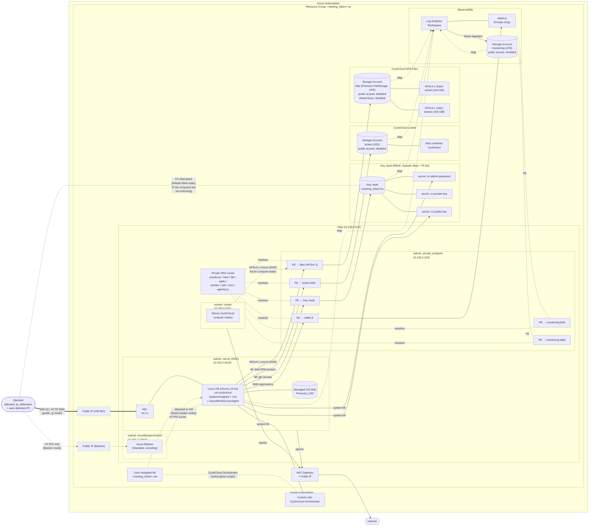

# cyclecloud_as_code

Terraform that stands up an isolated **Azure CycleCloud** test bench: a hardened
single-VM CycleCloud server (Ubuntu 24.04) with a supporting VNet, Bastion,
Key Vault, Log Analytics + AMPLS, private storage, and the IAM plumbing needed
for CycleCloud to manage compute resources in the same subscription.

> Scope: developer / lab environment. Not production-hardened (single region,
> no HA, minimal NSG coverage — only the `server` and `AzureBastionSubnet`
> subnets carry NSGs). See [docs/known-gaps.md](docs/known-gaps.md).

## What it deploys

| File | Resources |
|------|-----------|
| [terraform/main.tf](terraform/main.tf) | Resource group, naming pet (`random_pet.naming`, used when `application_name` is empty), `azuread_user` / `azurerm_subscription` data |
| [terraform/network.tf](terraform/network.tf) | VNet `10.150.0.0/16`, four subnets via `for_each` over `local.subnets`, NSG on the `server` subnet, NSG on `AzureBastionSubnet` (bastion mode only) |
| [terraform/natgateway.tf](terraform/natgateway.tf) | NAT Gateway + public IP, attached to the `cluster` and `server` subnets |
| [terraform/bastion.tf](terraform/bastion.tf) | Standard SKU Bastion with tunneling enabled (only when `access_mode = "bastion"`) |
| [terraform/keyvault.tf](terraform/keyvault.tf) | RBAC-mode Key Vault holding an ephemeral ED25519 SSH key pair (write-only secrets) and an auto-generated CycleCloud web-UI admin password, plus a `time_sleep` to wait for the caller's KV Administrator RBAC assignment to propagate before secrets are written. **`network_acls.default_action` is currently `Allow`** (see [docs/known-gaps.md](docs/known-gaps.md#key-vault-firewall)); the `ip_rules` list (configured + auto-detected operator IP) is computed but not enforcing |
| [terraform/ssh.tf](terraform/ssh.tf) | `ephemeral.tls_private_key` (ED25519) + `ephemeral.tls_public_key` — in-memory key pair that is never written to state; only the Key Vault secrets persist |
| [terraform/monitoring.tf](terraform/monitoring.tf) | Log Analytics workspace, linked storage account (private-only), `azurerm_log_analytics_linked_storage_account`, diagnostic settings for Key Vault / VM / monitoring storage blob+table services |
| [terraform/locker.tf](terraform/locker.tf) | Dedicated CycleCloud locker storage account (LRS, RBAC-only, public network disabled) with a private `cyclecloud` blob container and diagnostic settings forwarded to the shared workspace — isolated from the monitoring SA so locker churn doesn't pollute diagnostic logs and the VM identity's blob-data RBAC stays scoped to one account |
| [terraform/files.tf](terraform/files.tf) | Premium FileStorage account hosting two NFSv4.1 shares (`sched`, `shared`) for downstream Slurm scheduler state and cluster-wide shared data. Public network disabled, shared-access keys disabled (NFSv4.1 doesn't use them), HTTPS-only disabled (NFS is not HTTPS). Shares are provisioned at the Premium 100 GiB minimum quota (the dev-environment intent is ~10 GiB each). Reached over port 2049 via the file PE in private_endpoints.tf |
| [terraform/private_endpoints.tf](terraform/private_endpoints.tf) | Private DNS zones, VNet links, AMPLS scope + scoped service, PEs for Key Vault, monitoring storage (blob + table), locker storage (blob), NFS file storage (file), AMPLS |
| [terraform/cyclecloud.tf](terraform/cyclecloud.tf) | Ubuntu 24.04 managed OS disk built `FromImage`, NIC in `server` subnet, VM with `SystemAssigned + UserAssigned` identity, cloud-init rendered from [scripts/cloud-config.yaml.tftpl](scripts/cloud-config.yaml.tftpl) via `templatefile()`, Azure Monitor Linux Agent (`AzureMonitorLinuxAgent`) VM extension, boot diagnostics on Azure-managed storage; optional public IP + NSG on the NIC when `access_mode = "public_ip"` |
| [terraform/roles.tf](terraform/roles.tf) | Custom **CycleCloud Orchestrator Role `<naming_token>`** assigned at subscription scope to **both** the VM's system-assigned identity and the user-assigned identity (`azurerm_user_assigned_identity.cyclecloud`, attached to the VM and reserved for cluster-node use). Key Vault Administrator for caller, Key Vault Secrets User + Storage Blob Data Contributor (scoped to the dedicated locker SA) for the VM identity, Storage Blob + Table Data Contributor for the LA workspace identity on the monitoring SA |
| [terraform/locals.tf](terraform/locals.tf) | Subnet CIDR math via `cidrsubnet`, tag merging, DNS zone catalogs, `naming_token` / `naming_token_compact` (drive every resource name) |
| [terraform/outputs.tf](terraform/outputs.tf) | Resource group, VM name/IP, Bastion name, Key Vault URI, etc. |
| [scripts/cloud-config.yaml.tftpl](scripts/cloud-config.yaml.tftpl) | cloud-init template: installs OpenJDK 8, Azure CLI, and `cyclecloud8`, then runs the Phase 1 bootstrap — fetches the admin password + public key from Key Vault via managed identity, drops `account_data.json` into `/opt/cycle_server/config/data/` to bypass the web wizard, installs the CycleCloud CLI, runs `cyclecloud initialize` + `cyclecloud account create` to register the subscription with MSI auth. All secret-dependent steps live in a single `runcmd` shell block so the `CCPASSWORD` / `CCPUBKEY` shell vars stay in scope (cloud-init runs each list item in a fresh shell) |

### Subnet layout

`var.vnet_address_space` defaults to `["10.150.0.0/16"]`. From [terraform/locals.tf](terraform/locals.tf):

| Key (and subnet name) | CIDR | Used for |
|---|---|---|
| `cluster` | `10.150.0.0/23` | CycleCloud-managed compute nodes |
| `private_endpoint` | `10.150.2.0/26` | All `azurerm_private_endpoint` NICs |
| `server` | `10.150.2.64/26` | CycleCloud server VM NIC |
| `AzureBastionSubnet` | `10.150.2.128/26` | Bastion (name is required by Azure; only created when `access_mode = "bastion"`) |

## Architecture

The diagram below shows the Azure resources created by a single `terraform
apply` and how they wire together. Dashed components are conditional on
`var.access_mode` (Bastion vs. direct public IP); everything else is deployed
unconditionally.



**How to read it**

- **Solid double-arrow** = `public_ip` mode operator path (direct SSH / HTTPS
  from `var.allowed_ip_addresses` (+ the auto-detected operator IP) to the
  VM NIC's public IP, gated by the server-subnet NSG).
- **Dashed lines through Bastion** = `bastion` mode operator path (browser →
  Bastion public IP → tunneled SSH/HTTPS to the VM's private IP; no public
  IP on the VM).
- **Private endpoints** in the `private_endpoint` subnet are how the VM
  reaches Key Vault, the locker storage account, the monitoring storage
  account, and Azure Monitor. Both storage accounts have `public_network_
  access_enabled = false`, so they're reachable **only** via their PEs.
  The Key Vault is **currently** configured with `network_acls.default_
  action = "Allow"` (see [docs/known-gaps.md](docs/known-gaps.md#key-vault-firewall)) — the
  `allowed_source_ips` list (configured + auto-detected operator IP) is
  computed and assigned but not enforcing while default-Allow is in effect.
  Private DNS zones are VNet-linked so the storage / KV FQDNs resolve to
  the PE NICs from inside the VNet.
- **NAT Gateway** provides deterministic egress for the `cluster` and
  `server` subnets — required so package installs (`apt`, `cyclecloud8`,
  Azure CLI) and any future cluster nodes have outbound Internet without
  exposing inbound surface.
- **Identity**: the VM's **system-assigned** MI is the principal that holds
  the custom **CycleCloud Orchestrator** role at subscription scope (it
  also gets `Key Vault Secrets User` on the vault and
  `Storage Blob Data Contributor` on the locker SA). The **user-assigned**
  identity is attached to the VM and **also** holds the same
  CycleCloud Orchestrator role at subscription scope, so future
  cluster-node or CycleCloud-account auth flows that present the UAI
  have the same compute-management authority.

## Quickstart

The five-line happy path. Each step links to the doc that explains it:

```bash
# 1. Prereqs: Terraform ~> 1.15, Azure CLI logged in, Owner on the sub
#    -> docs/prerequisites.md
git clone git@github.com:430am/cyclecloud_testing.git && cd cyclecloud_testing
cd terraform
cp environments/example.tfvars.hcl environments/local.tfvars.hcl    # optional: add allowed_ip_addresses
export ARM_SUBSCRIPTION_ID=<your-sub-id> && az login
terraform init && terraform apply -var-file=environments/local.tfvars.hcl
```

Then wait ~5–10 min for the cloud-init bootstrap to finish on the VM and
log into the web UI — see [docs/post-deploy.md](docs/post-deploy.md).

## Docs

In-depth operator documentation lives in [docs/](docs/README.md):

- [Prerequisites](docs/prerequisites.md) — tooling, Azure permissions, network access, provider auth.
- [Deploying](docs/deploying.md) — clone, configure tfvars, `terraform init / plan / apply`.
- [Access modes](docs/access-modes.md) — choosing between `bastion` and `public_ip`; opening the web UI.
- [SSH private key](docs/ssh-key.md) — pulling the key from Key Vault and using it with `ssh` / `ssh-agent` / Bastion tunneling.
- [Variables](docs/variables.md) — every input variable + the naming convention.
- [Post-deploy](docs/post-deploy.md) — what the cloud-init bootstrap does, how to verify it, how to log in.
- [Testing](docs/testing.md) — static checks, `terraform test`, and the planned end-to-end deploy suite.
- [Known gaps / TODO](docs/known-gaps.md) — intentional rough edges (KV firewall, cluster automation, NSG coverage, etc.).
